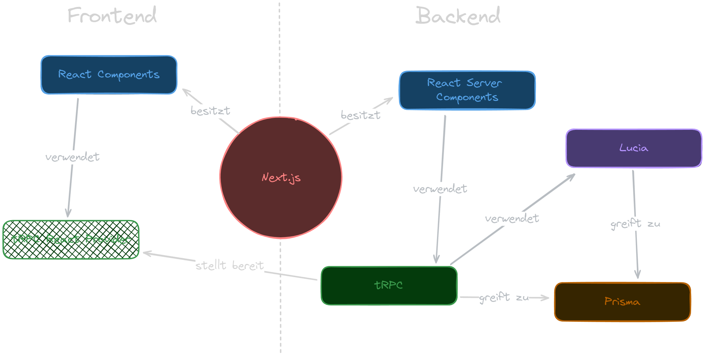

# Documentation

## 1. Einleitung

Bei ReadR handelt es sich um eine Web-Applikation, die das Lesen und Veröffentlichen von Romanen ermöglicht. Optimiert wird die Anwendung auf das Layout sog. Light-Novels. Anders als bei üblichen Romanen, wird hier i.d.R. in wöchentlichen Intervallen jeweils ein neues Kapitel veröffentlicht, das im Durschnitt ca. 3000 Wörter umfasst. Ziel ist, Nutzern eine zentrale, einheitliche und optisch ansprechende Oberfläche zu bieten.

### 1.1 Anforderungen

#### 1.1.1 Authentifizierung

Benutzer registrieren sich auf der Seite <kbd>/signup</kbd> mittels E-Mail, Nutzername und Passwort. Die Nutzung von Drittanbieter-Authentifizierungsdiensten wie Google oder Facebook wird nicht unterstützt. Nach erfolgreicher Registrierung wird automatisch eine Sitzung für den Nutzer erstellt, die es ihm ermöglicht, sich über die Seite <kbd>/signin</kbd> bei Bedarf erneut anzumelden.

#### 1.1.2 Benutzer

Benutzer haben die Möglichkeit, ihre E-Mail-Adresse und ihren Benutzernamen auf der Seite <kbd>/profile</kbd> anzupassen. Des Weiteren können sie auf der Seite <kbd>/publish</kbd> eigene Geschichten erstellen. Zusätzlich besteht die Option, Geschichten als Favoriten zu markieren und sie der persönlichen Liste auf der Seite <kbd>/favorites</kbd> hinzuzufügen. Kommentare können zu jeder Geschichte beliebig hinzugefügt werden. Ferner können Benutzer die sogenannten "Insights" auf der Seite <kbd>/novel/{novelId}</kbd> aktivieren und benutzerdefinierte Insights auf der Seite <kbd>/novel/{novelId}/insights</kbd> hinzufügen. Zudem steht es ihnen frei, jedes Kapitel einer Geschichte zu lesen.

#### 1.1.3 Autoren

Autoren sind definiert als Benutzer, die mindestens eine Geschichte erstellt haben. Sie haben die Befugnis, ihre eigenen Geschichten zu verwalten, einschließlich der Anpassung von Name, Beschreibung, Cover, Genre und Status auf der Seite <kbd>/novel/{novelId}/edit</kbd>. Des Weiteren können sie neue Kapitel veröffentlichen und Insights erstellen.

#### 1.1.4 Administratoren

Administratoren sind die einzigen Benutzer, die Zugriff auf die Seite <kbd>/site-settings</kbd> haben. Dort können sie alle Ressourcen in begrenztem Umfang verwalten. Die <kbd>\<Showcase/></kbd> Komponente zeigt eine Diashow von Covern von Geschichten an, deren Auswahl von Administratoren getroffen werden kann. Administratoren können die E-Mail-Adresse, den Nutzernamen oder die Rolle eines jeden Nutzers ändern und Benutzerkonten löschen. Für Genres besteht ausschließlich die Möglichkeit, weitere Einträge hinzuzufügen. Bei Geschichten können Name und Beschreibung geändert und Ressourcen gelöscht werden. Kommentare und Kapitel können nur gelöscht werden. Für jede dieser Einstellungen existiert ein Modal mit einer filterbaren Tabelle.

#### 1.1.5 Insights

Insights sind Zuordnungen von Wörtern (Triggern) zu einem bestimmten Kontext. So kann beispielsweise dem Namen der Protagonisten der Geschichte der Kontext 'Protagonist der Geschichte' hinzugefügt werden. Autoren können einen globalen Kontext für die Geschichte verwalten, während Leser nur benutzerdefinierte Kontexte besitzen. Beim Erstellen eines Insights durch den Autor muss ein Kapitel angegeben werden, ab dem der Kontext in der Geschichte sichtbar wird. Auf diese Weise wird der Kontext nur für Leser angezeigt, die bereits zu dieser Stelle in der Geschichte gelesen haben. Benutzer können Insights pro Geschichte nach Kategorie (global oder benutzerdefiniert) aktivieren oder deaktivieren. Benutzer können einem Trigger nur einen Kontext zuweisen. Es können also auf globaler und benutzerdefinierter Ebene zwei Insights mit jeweils unterschiedlichem Kontext erstellt werden.

## 2. Randbedingungen

Es wird angestrebt, ein einheitliches Design für die Benutzeroberfläche zu verwenden, um eine konsistente Nutzererfahrung zu gewährleisten. Jedoch wird darauf hingewiesen, dass eine vollständige Vereinheitlichung nicht garantiert werden kann. Unterschiede in der Gestaltung können auftreten, insbesondere wenn sie durch spezifische Anforderungen oder Funktionalitäten gerechtfertigt sind.

Obwohl auf eine angemessene Fehlerbehandlung geachtet wird, liegt der Fokus nicht primär darauf. In einigen Fällen kann es vorkommen, dass Fehler nicht vollständig behandelt werden, insbesondere wenn sie die grundlegende Funktionsweise der Anwendung nicht beeinträchtigen oder wenn sie auf der Client-Seite auftreten und die Nutzung der Anwendung nicht verhindern. Es wird jedoch angestrebt, sicherzustellen, dass kritische Fehler vermieden werden und dass die Anwendung insgesamt robust und zuverlässig ist.

Zusätzlich ist zu beachten, dass nicht alle Funktionalitäten in jeder Form zur Verfügung stehen, da der Umfang des Projekts begrenzt ist. Während sich das Projekt darauf konzentriert, eine Vielzahl von Kernfunktionen bereitzustellen, können einige erweiterte oder spezifische Funktionen möglicherweise nicht implementiert sein. Dies kann auf Ressourcenbeschränkungen, Zeitbeschränkungen oder andere Projektfaktoren zurückzuführen sein. Dennoch wird angestrebt, die wesentlichen Funktionen bereitzustellen, die für eine effektive Nutzung der Anwendung erforderlich sind.

## 3. Lösungsstrategie

Für die Entwicklung dieser Anwendung wurden verschiedene Technologien und Frameworks verwendet, um eine robuste und benutzerfreundliche Lösung zu gewährleisten. Das Template "create-t3-app" diente als Ausgangspunkt für die Projektstruktur und Konfiguration.

### 3.1 Next.js

Next.js ist ein Open-Source Full-Stack React Framework. Für diese Anwendung wurde Next.js in der Version 14.1.0 mit dem App-Router verwendet. Als Programmiersprache wurde TypeScript gewählt, da in größeren Anwendungen schnell Typ-Probleme auftreten können. Die Type-Safety, die TypeScript bietet, schafft Sicherheit und ermöglicht es, Fehler schnell zu erkennen.

### 3.2 Prisma

Prisma ist ein Datenbank-Toolkit, das die Interaktion mit Datenbanken in Anwendungen vereinfacht. Es bietet eine deklarative Datenmodellierungssprache, mit der Tabellen und Beziehungen in der Datenbank definiert werden können, ohne dass SQL geschrieben werden muss. Prisma generiert automatisch sicheren und leistungsfähigen Datenbankzugriffscode basierend auf dem Datenmodell, der Typsicherheit und eine intuitive API für Datenbankabfragen bietet.

### 3.3 tRPC

tRPC ist ein Framework zur Entwicklung von APIs für TypeScript und JavaScript-Anwendungen. Es ermöglicht die einfache Erstellung von API-Endpunkten mit Typsicherheit und automatischer Codegenerierung.

### 3.4 Zod

Zod ist eine TypeScript-Bibliothek, die für die Validierung von Datenstrukturen und die Erstellung von Typen entwickelt wurde. Sie ermöglicht Entwicklern, Datenstrukturen zu definieren und Typen zu erstellen, um die Ein- und Ausgaben ihrer Anwendungen zu validieren.

### 3.5 Lucia

Lucia ist eine Authentifizierungs- und Autorisierungsbibliothek, die für die Integration von Benutzeranmeldungen und Sitzungsverwaltung in Webanwendungen entwickelt wurde. Sie ermöglicht es Authentifizierungs- und Autorisierungsmechanismen in Anwendungen zu integrieren. Zusätzlich bietet Lucia einen Adapter für Prisma, was die Integration mit der Datenbank stark vereinfacht.

### 3.6 Lucide

Die Lucide Icon Library ist eine umfangreiche Sammlung von Vektor-Symbolen, die für die Verwendung in Webanwendungen optimiert ist.

### 3.7 tailwindcss

Tailwind CSS ist ein anpassbares CSS-Framework, das darauf abzielt, die Gestaltung von Benutzeroberflächen in Webanwendungen zu vereinfachen. Es bietet eine umfangreiche Sammlung von vorgefertigten Utility-Klassen.

### 3.8 shadcn/ui

shadcn/ui ist eine React-Komponentenbibliothek, die für die Entwicklung von modernen und ansprechenden Benutzeroberflächen in Webanwendungen entwickelt wurde. Die Komponenten werden als <kbd>jsx</kbd> bzw. <kbd>tsx</kbd> in das Projekt geladen und können so simpel bearbeitet werden.

## 4. Bausteinsicht



Die Struktur der Anwendung ist folgendermaßen aufgebaut:

```
.
└── readr.fklk.dev/
    ├── prisma/
    ├── public/
    │   └── cover/
    └── src/
        ├── app/
        │   ├── (auth)/
        │   │   ├── signin/
        │   │   └── signup/
        │   ├── (main)/
        │   │   ├── (novel-list)/
        │   │   │   ├── browse/
        │   │   │   ├── favorites/
        │   │   │   ├── popular/
        │   │   │   └── search/
        │   │   ├── home
        │   │   ├── insights
        │   │   ├── novel/
        │   │   │   ├── [novelId]/
        │   │   │   │   ├── chapter/
        │   │   │   │   │   └── [chapterId]/
        │   │   │   │   ├── edit/
        │   │   │   │   └── insights/
        │   │   │   └── me/
        │   │   ├── profile/
        │   │   ├── publish/
        │   │   └── site-settings/
        │   └── api/
        │       └── trpc/
        │           └── [trpc]/
        ├── components/
        │   ├── base/
        │   │   └── header/
        │   ├── button/
        │   │   ├── insight/
        │   │   └── novel/
        │   ├── card/
        │   │   ├── insight/
        │   │   ├── novel/
        │   │   └── site-settings/
        │   ├── form/
        │   ├── modal/
        │   │   ├── novel/
        │   │   └── site-settings/
        │   ├── selector/
        │   ├── shadcn/
        │   └── table/
        │       └── site-settings/
        ├── config/
        │   └── tables/
        │       └── site-settings/
        ├── lib
        ├── server/
        │   └── api/
        │       └── routers/
        └── trpc
```

In dem App Ordner befinden sich ausschließlich React (Server) Komponenten. Die <kbd>page.tsx</kbd> Datei in den jeweiligen Ordnern sind i.d.R. "React-Server-Components". Komponenten, die in der <kbd>page.tsx</kbd> verwendet wurden, sind dann Client Komponenten, wenn die Darstellung als Server Komponente aus gegebenen Umständen nicht möglich ist. Gleiches gilt für alle Dateien unter <kbd>src/components</kbd>. In dem <kbd>shadcn</kbd> Ordner unter <kbd>src/components</kbd> befinden sich alle von der Komponentenbibliothek verwendeten Komponenten.

Der <kbd>prisma</kbd>-Ordner enthält das Datenbankschema sowie eine "seed"-Datei für die Initialisierung der Datenbank mit Beispieldaten.

Unter <kbd>server</kbd> und <kbd>trpc</kbd> befinden sich Konfigurationsdateien für tRPC, einschließlich der API-Router.

Im <kbd>config</kbd>-Ordner sind Konfigurationsdateien für die Tabellenspalten in <kbd>/site-settings</kbd> abgelegt.

Der <kbd>lib</kbd>-Ordner enthält sowohl Konfigurationen für Lucia und Prisma als auch Utility-Dateien für häufig verwendete Funktionen und Server-Aktionen.

## Laufzeitsicht

-   Beschreibung der Abläufe und Interaktionen während der Laufzeit
-   Beispiele für typische Nutzerinteraktionen, z.B.:
    -   Registrierung und Anmeldung
    -   Erstellen und Bearbeiten von Geschichten
    -   Lesen und Kommentieren von Geschichten

## Verteilungssicht

-   Beschreibung der Verteilung der Anwendungskomponenten, z.B.:
    -   Deployment-Architektur (Server, Datenbank, Frontend-Server)
    -   Skalierbarkeit und Ausfallsicherheit

## Schnittstellensicht

-   Beschreibung der Schnittstellen zwischen den einzelnen Bausteinen
-   API-Endpunkte für die Kommunikation zwischen Frontend und Backend
-   Externe Schnittstellen zu Authentifizierungsdiensten oder anderen APIs

## Datensicht

-   Beschreibung der Datenmodelle und Datenbankstrukturen
-   Beispiele für Datenobjekte, z.B.:
    -   Benutzerprofile
    -   Geschichten
    -   Kommentare
